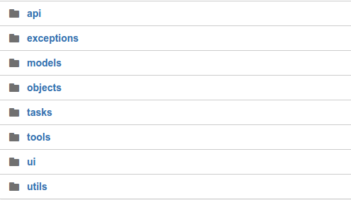
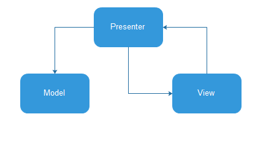
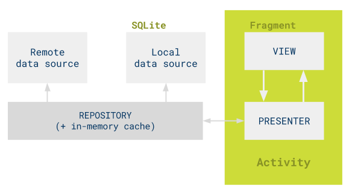
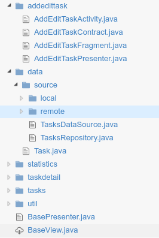
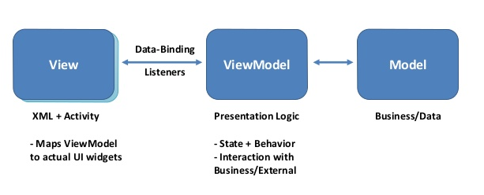
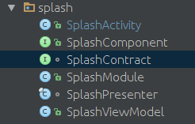
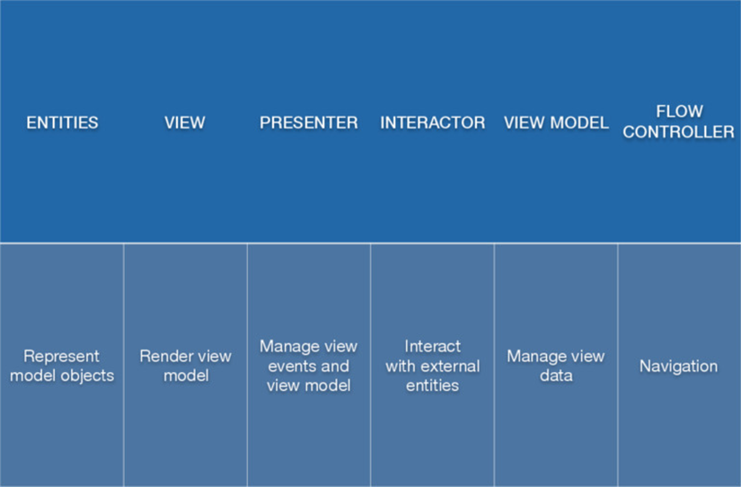

I intent to write this post when Google has just released the new Android Nougat with a ton of cool stuff coming out. Since then, many things have also changed. Android architecture is one of them which we will discuss in this post right now.

### Which architecture have you been using ?

Look back at the past! At the first time I came to Android world, I started to write my first project using android framework. Everything that I need to do is MAKE IT RUN - project manager as well as customer don't care about what I wrote, the only thing I had to do is make the appplication features work well. And, my boss gave me a compliment no matter how many Sh!t I threw to the source code. But at that moment, I thought my code is beautiful and has good structure. The code looks like this



* I put api stuff in a separated folder which take care of api calling
* models as its name is a kind of entity.
* objects is data structure being used in app *(not business object)*.
* utils to deal with android Framework, specified stuff make you easier to write android code.
* ui contains 4 subfolder: activities, fragments, adapters, views.

I also wrote BaseActivity, BaseFragment, BaseAdapter and convince myself that I'm writing clean code which is reusable, project structure is clear and can adapt new requirements and features from customer in a short time. But, **I was wrong!**

Let me tell you the reason why I was wrong. Take a look at above architecture! It's kinda MVC but ... not really. I'm pretty sure there is no real MVC in Android world. You can disagree with me because it's easy to see

* MODEL is models folder
* VIEW is xml layout files
* CONTROLLER is Activity or Fragment!

But, Activity, Fragment are kinda VIEW too because it also cares about UI stuff, setContentView, setActionBar, create dynamic View , ... There is no boundary between them, too much code in Activity, Fragment makes everything is a mess !! Engineers from Google do not seem to design Android to fit well with MVC architecture like many web framework and iOS do.

So, It seems like I developed above project with no architecture. In another word, the code structure depends too much on Android Framework. All we can see when look at the source code is "this is a android project", It doesn't expose anything about what project wrote for, what project feature is, etc.

Moreover, there are a ton of boilerplate code an Android developer need to write everyday, how boring it is!

So, we can make the Android world better by apply effective architecture. MVP or MVVM are promising candidates.

### How about MVP?

Before we talk about how to use MVP in Android, take a look at diagram



Model knows nothing about View. Presenter act as a man in the middle which take care of business logic. It retrieves data from the model and returns it formatted to the view. The relationship between Presenter and View is 1-1.

In Android, we're totally enable to apply MVP architecture, the diagram transform to



Remote data source is responsible for API interaction. Local data source can be file storage, shared preferences or local database. We can think of Model in term of Repository which handle everything relate to data in our app, synchronize data between remote and local, decide where data come from. Remember that Model isn't Entity, Entity is business object and just a part of Model. As I mention above, Presenter have 1-1 relationship with View, It fetch data from Model, do some business logic and display on View. That's basic concept about MVP architecture. I'll show you the code to better understand what it looks like.



The first thing we can see, the code structure is totally different. Folders rely on project features, each of features is a folder, hence we can easily understand this project is a TODO-list application, we can add task, edit task and do a statistics. This structure is clearly better than first structure, instead of knowing this project as an Android project, we understand what project feature is, where data comes from as well as another business stuff.

Moreover, the most powerful thing about MVP architecture is **SCALE**. We can easily remove a feature or add a new feature without affecting the other components. Really really awesome!

Data folder acts as Model in MVP architecture, which contains entity, local database interaction, api calling, etc. Inside each of feature folders, we can see the View, Presenter and their relationship.
For example, we have `addedittask` folder represent for add/edit a task feature. we have `AddEditTaskContract.java` is relationship class between View and Presenter

***

```java
public interface AddEditTaskContract {

    interface View extends BaseView<Presenter> {

        void showEmptyTaskError();

        void showTasksList();

        void setTitle(String title);

        void setDescription(String description);

        boolean isActive();
    }

    interface Presenter extends BasePresenter {

        void saveTask(String title, String description);

        void populateTask();
    }
}
```

***

The code explains everything, View asks Presenter for `saveTask` or `populateTask` and vice versa, Presenter after interact with Repository, can ask View for `showTaskList`, `showError`, `setTitle`, etc.
Let's implement presenter in `AddEditTaskPresenter.java`

***

```java
public class AddEditTaskPresenter implements AddEditTaskContract.Presenter,
        TasksDataSource.GetTaskCallback {

    private final TasksDataSource mTasksRepository;

    private final AddEditTaskContract.View mAddTaskView;

    private String mTaskId;

    public AddEditTaskPresenter(@Nullable String taskId, @NonNull TasksDataSource tasksRepository,
            @NonNull AddEditTaskContract.View addTaskView) {
        mTaskId = taskId;
        mTasksRepository = checkNotNull(tasksRepository);
        mAddTaskView = checkNotNull(addTaskView);

        mAddTaskView.setPresenter(this);
    }

    @Override
    public void start() {
        if (!isNewTask()) {
            populateTask();
        }
    }

    @Override
    public void saveTask(String title, String description) {
        if (isNewTask()) {
            createTask(title, description);
        } else {
            updateTask(title, description);
        }
    }

    @Override
    public void populateTask() {
        if (isNewTask()) {
            throw new RuntimeException("populateTask() was called but task is new.");
        }
        mTasksRepository.getTask(mTaskId, this);
    }

    @Override
    public void onTaskLoaded(Task task) {
        // The view may not be able to handle UI updates anymore
        if (mAddTaskView.isActive()) {
            mAddTaskView.setTitle(task.getTitle());
            mAddTaskView.setDescription(task.getDescription());
        }
    }

    @Override
    public void onDataNotAvailable() {
        // The view may not be able to handle UI updates anymore
        if (mAddTaskView.isActive()) {
            mAddTaskView.showEmptyTaskError();
        }
    }

    private boolean isNewTask() {
        return mTaskId == null;
    }

    private void createTask(String title, String description) {
        // TODO
    }

    private void updateTask(String title, String description) {
        // TODO
    }
}
```

***

And finally we can pick Activity or Fragment act as View. Here is `AddEditTaskFragment.java`

***

```java
public class AddEditTaskFragment extends Fragment implements AddEditTaskContract.View {

    public static final String ARGUMENT_EDIT_TASK_ID = "EDIT_TASK_ID";

    private AddEditTaskContract.Presenter mPresenter;

    private TextView mTitle;

    private TextView mDescription;

    public static AddEditTaskFragment newInstance() {
        return new AddEditTaskFragment();
    }

    public AddEditTaskFragment() {
        // Required empty public constructor
    }

    @Override
    public void onResume() {
        super.onResume();
        mPresenter.start();
    }

    @Override
    public void setPresenter(@NonNull AddEditTaskContract.Presenter presenter) {
        mPresenter = checkNotNull(presenter);
    }

    @Nullable
    @Override
    public View onCreateView(LayoutInflater inflater, ViewGroup container,
                             Bundle savedInstanceState) {
        View root = inflater.inflate(R.layout.addtask_frag, container, false);
        mTitle = (TextView) root.findViewById(R.id.add_task_title);
        mDescription = (TextView) root.findViewById(R.id.add_task_description);
        return root;
    }

    @Override
    public void showEmptyTaskError() {
        Snackbar.make(mTitle, getString(R.string.empty_task_message), Snackbar.LENGTH_LONG).show();
    }

    @Override
    public void showTasksList() {
        getActivity().setResult(Activity.RESULT_OK);
        getActivity().finish();
    }

    @Override
    public void setTitle(String title) {
        mTitle.setText(title);
    }

    @Override
    public void setDescription(String description) {
        mDescription.setText(description);
    }

    @Override
    public boolean isActive() {
        return isAdded();
    }
}

```

***

You can find full source code of todo-list application sample [here](https://github.com/googlesamples/android-architecture/tree/todo-mvp/todoapp/app/src/main/java/com/example/android/architecture/blueprints/todoapp/addedittask)
. These sample code contributed by talent google employees as well as non-google employees. So, It's a great scalford to start coding your Android app in MVP architecture.

### How about MVVM ?

It goes without saying that MVP is really awesome, makes source code maintainable, clean and scalable. But we should consider MVVM as another great choice. Since, Google IO 2016 introduced new [data-binding](https://developer.android.com/topic/libraries/data-binding/index.html) framework, this is a big step of Android architecture and I do believe that data-binding is the future of Android, pushes Butterknife or Android annotation into history.
No Android developer can keep themselves away from the beauty of data-binding. The only problem is time effort to move on. Many Android developers out there should feel uncomfortable with MVVM at first but believe me, ***It's worth!***

Let's see how beautiful it is



`findViewById()` `setAdapter()` `setText()` `setOnClickListener()` `setXXX()`. Please forget all of it! We have data-binding now
The key is ViewModel doesn't know anything about View. Let Data-binding do its work.

***

```xml
<?xml version="1.0" encoding="utf-8"?>
<layout xmlns:android="http://schemas.android.com/apk/res/android">
   <data>
       <variable name="handlers" type="com.example.Handlers"/>
       <variable name="user" type="com.example.User"/>
   </data>
   <LinearLayout
       android:orientation="vertical"
       android:layout_width="match_parent"
       android:layout_height="match_parent">
       <TextView android:layout_width="wrap_content"
           android:layout_height="wrap_content"
           android:text="@{user.firstName}"
           android:font="@{`open-sans`}
           android:onClick="@{handlers::onClickFriend}" />
   </LinearLayout>
</layout>
```

***

As we see above, there are a lot of interest stuff on `TextView`. We change `firstName` in `user` object, data-binding automatically reflects to `TextView`. We handle `onClickFriend` function without deal with `setOnClickListener`. Android is lack of font attribute in `TextView`, now, we can create ourselves `android:font` using data-binding. So convenient!

Or `RecyclerView` can be used in this beautiful way

***

```xml

<android.support.v7.widget.RecyclerView
        android:layout_width="match_parent"
        android:layout_height="match_parent"
        android:layoutManager="@{ viewModel.layoutManager }"
        android:recyclerAdapter="@{ viewModel.recyclerAdapter }"
        android:visibility="@{ viewModel.isLoading ? View.INVISIBLE : View.VISIBLE }" />

```

***

Using MVVM and data-binding help us save a lot of boilerplate code for UI, and we can keep ourselves focus on business logic from now. Relationship between View and ViewModel is 1-n. A ViewModel and its logic can be reused in various kinds of View. Model is the same as Repository in MVP that I mentioned above. It provides data for ViewModel. ViewModel contains business logic which handles data from Model. So, with MVVM, **less code in Fragment and Activity, more code in ViewModel.**

However, There is a drawback in MVVM compare with MVP. I don't really like to put the business logic inside ViewModel. A mix between Presentation logic and business logic, UI object and business object aren't the way to go.

### So, MVVM or MVP ?

Maybe, many developers out there have same questions with me on the way finding an effective architecture in Android. MVP is almost perfect except data-binding benefit. I love data-binding! But if I go on MVVM way, how to make my source code clean and scalable.

So, I'm thinking about a hybrid architecture, which rely on MVP and also use data-binding. The relationship between View and Presenter will be replaced by Presenter and ViewModel. Presenter act as a man in the middle between ViewModel and Model. ViewModel doesn't know about View. Each ViewModel relate to a Presenter. This architecture allows us keep business logic away from ViewModel. All business logics are now in Presenter. We can call it **MVVMP**

### MVVMP? Talk is cheap. Show me the code!

Because of the base concept is on MVP. So, code structure is the same, each of folders is a feature, repository as Model. Imagine we are developing splash screen feature. Whenever app start, splash  screen comes out and synchronize data. After that, app go to home screen. This is splash feature folder



SplashContract is the relationship between ViewModel and Presenter

***

```java

interface SplashContract {

    interface ViewModel extends BaseViewModel {

        void loading(boolean isLoading);

        void startHomeScreen();

        void showSyncFailMessage(String msg);
    }

    interface Presenter extends BasePresenter<ViewModel>  {

        void syncData();

    }
}
```

***

ViewModel asks Presenter for syncData. Presenter interacts with Model to synchronize then `startHomeScreen()` or `showSyncFailMessage()`. That's the main flow. But the special thing here is how we implement ViewModel.

***

```java

public class SplashViewModel extends BaseObservable implements SplashContract.ViewModel {

    private boolean mIsLoading = false;

    private boolean mIsShowSyncButton = false;

    private SplashContract.Presenter mPresenter;

    private Navigator mNavigator;

    @Inject
    public SplashViewModel(SplashContract.Presenter presenter, Navigator navigator) {
        mPresenter = presenter;
        mNavigator = navigator;
    }

    @Bindable
    public boolean getIsLoading() {
        return mIsLoading;
    }

    public void setIsLoading(boolean isLoading) {
        this.mIsLoading = isLoading;
        notifyPropertyChanged(BR.isLoading);
    }

    @Bindable
    public boolean getIsShowSyncButton() {
        return mIsShowSyncButton;
    }

    public void setIsShowSyncButton(boolean isShowSyncButton) {
        mIsShowSyncButton = isShowSyncButton;
        notifyPropertyChanged(BR.isShowSyncButton);
    }

    @Override
    public void loading(boolean isLoading) {
        setIsLoading(isLoading);
    }

    @Override
    public void showSyncButton(boolean isShow) {
        setIsShowSyncButton(isShow);
    }

    @Override
    public void startHomeScreen() {
        mNavigator.startActivityAtRoot(MainActivity.class);
    }

    @Override
    public void showSyncFailMessage(String msg) {
        mNavigator.showAlert(msg);
    }

    @Override
    public void start() {
        mPresenter.setViewModel(this);
        mPresenter.start();
        mPresenter.syncData();
    }

    @Override
    public void stop() {
        mPresenter.stop();
    }
}
```

***

Yep, Thanks to data-binding, we don't even need to have Context, TextView, Button or any UI stuff around here, so ViewModel looks really awesome. Presenter only contains business logic
***

```java
final class SplashPresenter implements SplashContract.Presenter {

    private static final int DELAY_TIME_IN_MILLIS = 1500;

    private Repository mRepository;

    private SplashContract.ViewModel mViewModel;

    @Inject
    public SplashPresenter(Repository repository) {
        mRepository = repository;
    }

    @Override
    public void syncData() {
        final boolean isFirstLoadData = mRepository.getIsFirstLoadData();
        if (isFirstLoadData) {
            mViewModel.loading(true);
        } else {
            new Handler().postDelayed(() -> {
                if (TextUtils.isEmpty(mRepository.getAccessToken())) mViewModel.startLoginScreen();
                else mViewModel.startHomeScreen();
            }, DELAY_TIME_IN_MILLIS);
        }
        mRepository.syncData(mRepository.getLastUpdateTime())
                .subscribe(data -> {
                    if (isFirstLoadData) {
                        mRepository.setIsFirstLoadData(false);
                        mViewModel.startLoginScreen();
                    }
                }, throwable -> {
                    if (isFirstLoadData) {
                        mViewModel.loading(false);
                    }
                });

    }

    @Override
    public void setViewModel(SplashContract.ViewModel viewModel) {
        mViewModel = viewModel;
    }

}
```

***

In Repository, We decide to `syncData` from API. So, the code will look like this

***

```java
public class Repository implements RemoteDataSource, LocalDataSource {

    private LocalDataSource mLocalDataSource;

    private RemoteDataSource mRemoteDataSource;

    @Inject
    public Repository(LocalDataSource localDataSource, RemoteDataSource remoteDataSource) {
        mLocalDataSource = localDataSource;
        mRemoteDataSource = remoteDataSource;
    }

    @Override
    public Observable<List<Song>> syncData(String lastUpdatedTime) {
        return mRemoteDataSource.syncData(lastUpdatedTime)
                .observeOn(AndroidSchedulers.mainThread())
                .subscribeOn(Schedulers.newThread()).
                        lift(subscriber -> new ActionSubscriber<>(
                                data -> updateSongs(data)
                                        .subscribe(subscriber::onNext, subscriber::onError),
                                subscriber::onError, Actions.empty()));
    }
}
```

***
That's the big picture about MVVMP and I hope you guys can imagine what I draw. With MVVMP, we can:
* Achieve a clean architecture.
* Enable to use data-binding.
* Unit test all of parts in application.
* A clean activity and fragment with very little code.
* A separated business logic
* ...

I highly recommend using Dagger, RxJava and Java 8 because it really make MVVMP much more beautiful and simpler.

### Give it a shot!

I'm always ready for the new things, so I decide to refactor an old project into new architecture. Of course, It took me a lot of time. In the real world, there are lots of stuff in Android framework we need to deal with to adapt an architecture strictly. Android comes with activity lifecycle, fragment lifecycle, broadcast, service, system events. All of this make the implementation of any architecture become a big challenge, especially MVVMP. Recently, I've watched an interesting presentation about an architecture known as VIPER. This architecture solve the problem I mentioned above. It uses an extra interactor beside presenter and viewmodel, which interact with system components and system events.



***

I know that feeling bro! Why so many architectures, is it really necessary? The answer is depend on you as well as your project requirements. To me, MVVMP is enough. Please show me which architecture you prefer by comment below. I'm pleased to hear from you.

