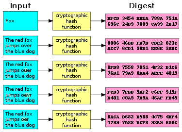
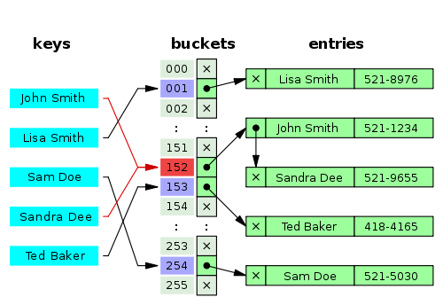

### Hash ở đâu

Ngày nay, Hash đã và đang được ứng dụng khắp mọi nơi.
- Mã hóa password trong database bằng hash
- Mọi commit trong Git đều được đánh Hash
- Protocol https truyền data qua TLS/SSl layer dùng Certification Fingerprints bằng Hash
- HashTag gây bão trên các trang mạng xã hội
- HashMap trong Android ...

***

### What's it!

Vậy thì lợi ích của việc sử dụng Hashing là gì mà khiến nó lại được ứng dụng rộng rãi như vậy.
Có thể kể ngay ra đó là dùng thuật toán để map 1 data với size tùy ý thành 1 chuỗi với size cố định. Đây là one-way function nên không thể cách nào dịch ngược từ mã Hash ra lại data ban đầu được. Cho nên 1 trong nhưng ứng dụng của nó là để che đi password. Sơ đồ dưới đây là mô tả rõ hơn về điều này



Còn trong lập trình, Hash được xem như 1 cách đánh index để tìm trong mảng nhanh hơn. Giả sử chúng ta có 1 list với N phần tử, thì việc get 1 phần tử trong `List` sẽ có độ phức tạp O(n) vì phải loop từ đầu đến cuối mảng, còn với `HashMap` việc tìm kiếm trong mảng chỉ mất O(1) trong điều kiện tốt. Việc này cũng tương tự như việc tra cứu từ tiếng Anh nào đó trong từ điển, giả sử bạn muốn tìm từ LOVE, thay vì lật từng trang sách từ đầu đến cuối, bạn sẽ nhảy ngay đến vùng ước lượng của chữ L, rồi trong đó tới vùng của chữ O, rồi V... và tìm ngay ra được giải thích định nghĩa cho từ LOVE. Tư tưởng này hoàn toàn tương tự trong Hash. Ứng dụng vào các trang mạng xã hội, với hàng triệu người dùng với hàng tỷ data, việc dùng `HashTag` sẽ giúp chúng ta truy xuất ra ngay được những data có Hash tương ứng chỉ trong vài giây. Anh TrungX đã có 1 post tuyệt hay về cái này, mình xin trích dẫn tại đây

[300 triệu bản ghi với Redis và giải pháp của Instagram](https://viblo.asia/trungx/posts/BYjv4k7xGxpV)

***

### Hash in Android

Bây giờ hãy cùng nhau đi sâu tìm hiểu `HashMap` trong Android. Nhìn tổng quan `HashMap` trong Android thường được anh em dev dùng làm cấu trúc dữ liệu lưu trữ data dưới dạng Key-Value (Tuy nhiên, mình recommend anh em nên dùng `SparseArray` để thay thế nếu có thể trong Android, vì performance vượt trội).
Trước khi đi sâu tìm hiểu HashMap thì hãy nhìn lại 1 tí về class Object trong Android cũng như Java. Object là class cha của mọi class khác và chắc bất cứ ai code Java cũng biết rõ về thằng này, nó khá là simple như sau:

```java
    public class Object {

        private transient Class<?> shadow$_klass_;
        private transient int shadow$_monitor_;

        public Object() {
        }

        protected Object clone() throws CloneNotSupportedException {
            if (!(this instanceof Cloneable)) {
                throw new CloneNotSupportedException("Class " + getClass().getName() +
                                                     " doesn't implement Cloneable");
            }

            return internalClone();
        }

        private native Object internalClone();

        public boolean equals(Object o) {
            return this == o;
        }

        protected void finalize() throws Throwable {
        }

        public final Class<?> getClass() {
          return shadow$_klass_;
        }

        public int hashCode() {
            int lockWord = shadow$_monitor_;
            final int lockWordStateMask = 0xC0000000;  // Top 2 bits.
            final int lockWordStateHash = 0x80000000;  // Top 2 bits are value 2 (kStateHash).
            final int lockWordHashMask = 0x0FFFFFFF;  // Low 28 bits.
            if ((lockWord & lockWordStateMask) == lockWordStateHash) {
                return lockWord & lockWordHashMask;
            }
            return System.identityHashCode(this);
        }

        public final native void notify();

        public final native void notifyAll();

        public String toString() {
            return getClass().getName() + '@' + Integer.toHexString(hashCode());
        }

        public final native void wait() throws InterruptedException;

        public final void wait(long millis) throws InterruptedException {
            wait(millis, 0);
        }

        public final native void wait(long millis, int nanos) throws InterruptedException;
    }
```

Hãy tập trung vào 2 method là `hashCode()` và `equals()`, nó sẽ liên quan trực tiếp đến HashMap mà chúng ta nói đến tiếp theo đây.
Thực ra, HashMap có 3 thành phần chính: HashFunction, HashValue và Bucket.
- HashFunction chính là `hashCode()` method, nó là 1 thuật toán để tạo ra Hash
- HashValue chính là return value của `hashCode()`
- Còn Bucket để chứa các giá trị Key-Value pair.



Giả sử chúng ta get() 1 value theo key từ `HashMap`. Key truyền vào sẽ dùng HashFunction để lấy ra Hash, rồi dùng Hash đó để tìm trong đống Buckets để lấy ra được value tương ứng. Ta có thể thấy ở sơ đồ trên sẽ có trường hợp và 2 Key khác nhau nhưng lại có cùng Hash (gọi là **Hash Collision**), nên sẽ trỏ đến cùng 1 bucket. Trong trường hợp này, method equals() sẽ vào cuộc. Tại bucket đang trỏ đến, method equals() sẽ compare các entries của bucket đó để tìm ra được entry chứa value thích hợp cho chúng ta.

**Hãy nhìn vào method get() trong HashMap để thấy rõ hơn quá trình này**

```java
    public V get(Object key) {
        if (key == null) {
            HashMapEntry<K, V> e = entryForNullKey;
            return e == null ? null : e.value;
        }

        int hash = Collections.secondaryHash(key);
        HashMapEntry<K, V>[] tab = table;
        for (HashMapEntry<K, V> e = tab[hash & (tab.length - 1)];
                e != null; e = e.next) {
            K eKey = e.key;
            if (eKey == key || (e.hash == hash && key.equals(eKey))) {
                return e.value;
            }
        }
        return null;
    }
```

- Ở line: `HashMapEntry<K, V>[] tab = table`. table này chính là các buckets ở trên. Mỗi Bucket được gọi là HashMapEntry, nó là 1 danh sách liên kết chứa key, value và hash.

```java
    static class HashMapEntry<K, V> implements Entry<K, V> {
        final K key;
        V value;
        final int hash;
        HashMapEntry<K, V> next;

        ...
    }
```

- Ở line: `int hash = Collections.secondaryHash(key);` Đây là method tính toán hash code và bổ sung thêm 1 hashfunction để tăng chất lượng của hashfunction trong key. Kì thực thì đến đoạn này, mình vẫn chưa hiểu đủ sâu để biết Google đang code cái gì để tăng chất lượng hash, tạm copy ra function đó để mọi người cùng tìm hiểu, nếu ai hiểu cơ chế xử lý bit trong HashCode thì hãy comment bên dưới để bài viết này được hoàn thiện hơn nữa.

```java
    private static int secondaryHash(int h) {
        // Spread bits to regularize both segment and index locations,
        // using variant of single-word Wang/Jenkins hash.
        h += (h <<  15) ^ 0xffffcd7d;
        h ^= (h >>> 10);
        h += (h <<   3);
        h ^= (h >>>  6);
        h += (h <<   2) + (h << 14);
        return h ^ (h >>> 16);
    }
```

- Như chúng ta nói từ trước, để tìm được từ LOVE trong từ điển chúng ta đến bucket của L, rồi tìm entry của O, V, E. Ở đây, Code sẽ dùng Hash từ line `int hash = Collections.secondaryHash(key);` đi tìm trong `HashMapEntry<K, V>[] tab = table`, để ra được `index = hash & (tab.length - 1);`. Trường hợp gặp Collision thì tiếp tục `if (e.hash == hash && key.equals(e.key))` để tìm ra value đúng trong danh sách liên kết HashMapEntry tương ứng với index ở trên.

***

### Tổng kết

Như vậy, chúng ta đã hiểu hơn về sự lợi hại của HashMap trong Android và cách dùng Hash để đi tìm index trong table. Nói tiếp về performance của HashMap, độ phức tạp của `get()` `put()` vào HashMap chỉ là O(1) trong điều kiện cách Hash phân tán đều vào các bucket, tức là mỗi bucket chỉ chứa 1 HashMapEntry. Quá tuyệt vời nếu sử dụng nó với BigData lên đến hàng triệu bảng ghi.
Có 2 yếu tố ảnh hưởng đến performances của 1 HashMap, đó là Capacity và Load Factor
- Capacity là số lượng ban đầu của Buckets
- Load Factor là tỉ lệ số Buckets đã được dùng so với tối đa. Khi đạt đến tỉ lệ này thì Capacity sẽ được nhân đôi để lấy thêm sức chứa mà put data mới vào

Capacity default trong Android là 16 và Load Factor default là 0.75. Nên khi ta put() 12 data vào HashMap thì Capacity của nó sẽ được nhân lên thành 32.

Bài viết cũng chỉ mới đi sâu vào những thứ đầu tiên của HashMap. Và vẫn còn rất nhiều thứ phía bên dưới, những HashFunction như là: MD5, SHA-1, SHA-2, SHA-256,... hoạt động như thế nào, thuật toán về bit ở trên như thế nào. Rất mong được mọi người đóng góp thêm vào bài viết bằng cách comment phía bên dưới.
