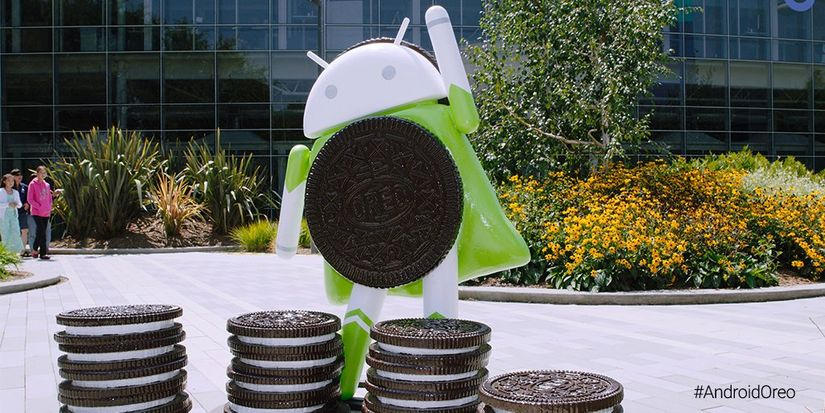

As we are expecting about new Android version - Android O, on August 22nd, Google offically launch Android O what we known as Android Oreo, my favorite cookie by the way haha. So, I decided to write this post to discuss about one of the most important change - the background service mechanism. 
Before Oreo, everytime and go to the coffee shop to meet up with some iOS friends, they complain that background job is freaking hard on iOS, I laughed at their faces because of how easy Android background job is. But, every easy things came with their disadvantages, background service is also the biggest problem in Android, which makes the phone drain battery so fcking hard. Now, the time has come, Google made up themselves and force Android developers communities to "serve" the end-users, brings end-user a better experiences.
Ok, let's talk about how background things has changed. 

## App cannot run freely in the background 

- Call start service in background will cause IllegalStateException
    - NO service 
    - NO send for pending intent wrapping services
- When move app from foreground to background -> services SHUTDOWN
- CANNOT register implicit broadcasts in the manifest. However, following implicit broadcasts are still allowed to register
    - ACTION_LOCKED_BOOT_COMPLETED, ACTION_BOOT_COMPLETED
    - ACTION_USER_INITIALIZE
    - ACTION_LOCALE_CHANGED
    - ACTION_USB_ACCESSORY_ATTACHED, ACTION_USB_ACCESSORY_DETACHED, ACTION_USB_DEVICE_ATTACHED, ACTION_USB_DEVICE_DETACHED
    - ACTION_HEADSET_PLUG
    - ACTION_CONNECTION_STATE_CHANGED, ACTION_CONNECTION_STATE_CHANGED, ACTION_ACL_CONNECTED, ACTION_ACL_DISCONNECTED
    - ACTION_CARRIER_CONFIG_CHANGED
    - LOGIN_ACCOUNTS_CHANGED_ACTION
    - ACTION_PACKAGE_DATA_CLEARED
    - ACTION_PACKAGE_FULLY_REMOVED
    - ACTION_NEW_OUTGOING_CALL
    - ACTION_DEVICE_OWNER_CHANGED
    - ACTION_EVENT_REMINDER
    - ACTION_MEDIA_MOUNTED, ACTION_MEDIA_CHECKING, ACTION_MEDIA_UNMOUNTED, ACTION_MEDIA_EJECT, ACTION_MEDIA_UNMOUNTABLE
    - SMS_RECEIVED_ACTION, WAP_PUSH_RECEIVED_ACTION
-  Location system service computes a new location for your app only a few times each hour

## Ops! How can I deal with this :((

### Options for dealing with service:
- Schedule a job: 
    - 90% of times this will save you life. 
    - Where can I find the doc for it? Here: https://developer.android.com/reference/android/app/job/JobScheduler.html and here: https://developer.android.com/reference/android/support/v4/app/JobIntentService.html
    - So, just enqueue or schedule a job, and Android will smart enough to execute it in appropriate time (when connected to wifi, when plugin the power, when battery full, ...) .
- FCM  + Temporary service whitelist:
    - App will be temporary in whitelist in following cases: high priority FCM,  SMS/MMS delivery, action from notification. So that, we can start a service as if our app is in the foreground
- Foreground service:
    - If user can understand why your app need to running a background service, you can use foreground service so your service should never being killed. Because, this kinda services show an persistent notification on notification bar which informs to user you are running a service (It's mostly look like music player or map navigation on notification bar)
    - So, how can I start a foreground service! Notice that start a foreground service from background will no longer work. There are  3 steps to do it: 
        - `startForegroundService(service: Intent)` should create a service and you need promote it to foreground by moving to next steps
        - Make a `notification` with low priority or higher so that, user can be notified 
        - Promote service to foreground by `startForeground(id: Int, notification: Notification)`
- If none of above solutions work for you, you might consider defer your work until your app is on the foreground again. Of courses, maybe you wouldn't achieve a good user experience because user need to wait a little bit for processing and feel like non-realtime experience

### Next, How do I test whether background things work properly!!
- Google brings you the powerful adb command right there, feel free to use it 

```bash
// runs app in background
adb shell am make-uid-idle <package>
// force background limitations
adb shell cmd appops set <package> RUN_IN_BACKGROUND deny
// return app to normal behavior 
adb shell cmd appops set <package> RUN_IN_BACKGROUND allow
```

### Options for dealing with broadcast receiver:
- Broadcast whitelist
    - Take look at above whitelist broadcast. If you use one of them, yeah, you should be fine, nothing to worry 
- Use Job
    - Job can be used in following cases: network connectivity changed, charging status, content provider URI changes, low storage, low battery.  For example:
``` java
// Adds a trigger that monitors user takes a picture 
mJobBuilder.setTrigger(
    Trigger.contentUriTrigger(
        Arrays.asList(
                new ObservedUri(
                    MediaStore.Images.Media.EXTERNAL_CONTENT_URI,
                    ObserverdUri.Flags.FLAG_NOTIFY_FOR_DESCENTDANT))));
```
- Use dynamic broadcast receiver
    - You can register/unregister in Activity/Fragment by yourself without write it in Manifest. Usually, It's should be sit in onResume/onPause in the lifecycle 

Ok that's it. I appreciate this changes of Android on Oreo version. This would be a big step that Google have made to Android community as well as end-user who don't own a powerful hardware. This step would brings Android performance closer to iOS and It worth the effort of developers who spend hours to migration their app to targets android O.

