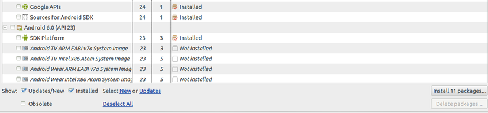
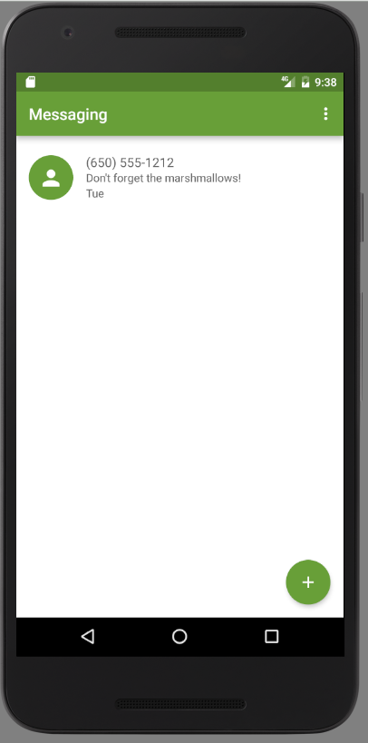
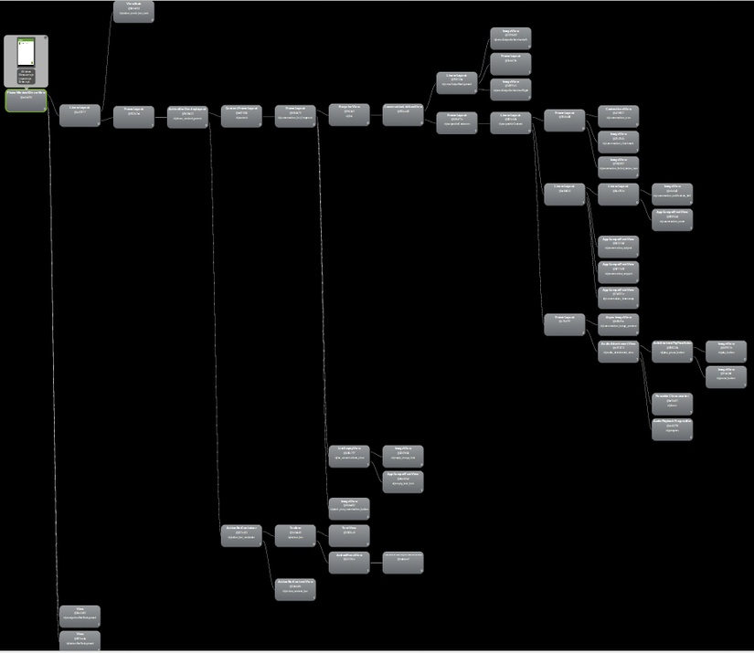
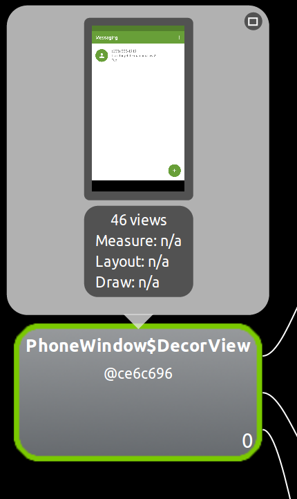
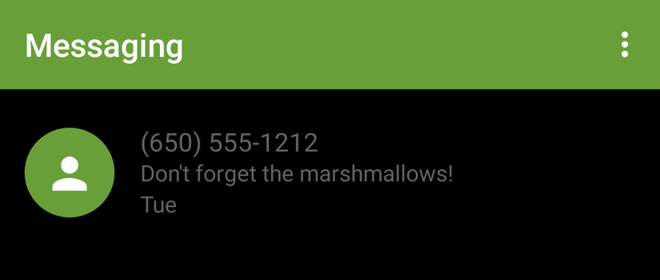

### Lời nói đầu

Đây là bài đầu tiên trong series bài viết Under The Hood. Mục đích của series này là dive deeper vào các những thứ anh em dev thường dùng trong Android Framework: View, RecyclerView, AsyncTask, Activity,... cũng như là các library nổi tiếng không thể thiếu như: Retrofit, Picasso, Dagger, Butterknife,... Việc đọc code của những dev thần thánh đến từ Google hay Square đầu tiên sẽ giúp chúng ta hiểu hơn về  những library, framework chúng ta sử dụng hằng ngày, hiểu sâu hơn thì sẽ dùng chúng hiệu quả hơn, xa nữa là contribute vào đó để fix 1 issue nào đó chúng ta phát hiện ra trong lúc code, hay để thêm vào 1 tính năng mới vào library, framework mà ta nghĩ là hay.

Open Source mà, mình thích thì mình pull request thôi!

***

### View System

Hôm nay, bài viết này sẽ nói về UI trong Android. Đã bao giờ bạn tự hỏi giao diện mà Android vẽ nên đằng sau nó là gì. ScrollView nhận thao tác vuốt từ người dùng và cuộn giao diện lên xuống như thế nào, RecyclerView render các Item của nó ra sao, hay tại sao View con lại nằm trong parent của nó với margin padding chính xác được. Bài viết sẽ dựa trên sources code **android-23**. Các bạn có thể
install sources thông qua Android SDK Manager để tiện theo dõi



***

- Chúng ta sẽ bắt đầu bằng cách lấy app tin nhắn quen thuộc để làm ví dụ và dùng tool Hierarchy View để có cái nhìn sâu hơn bên dưới UI.
**Đây là giao diện mà Android vẽ nên cho app tin nhắn**



- **Và đằng sau đó là cả 1 Tree View, trông nó sẽ như thế này**



- **Root của TreeView là PhoneWindow$DecorView**.



Đây là class top-level của các View, dưới cả Activity, nó nằm gần nhất với Window (màn hình) của device, nơi vẽ mọi View của app. Và đây là source code [PhoneWindow](https://android.googlesource.com/platform/frameworks/base/+/696cba573e651b0e4f18a4718627c8ccecb3bda0/policy/src/com/android/internal/policy/impl/PhoneWindow.java), Root trên chính là line #1610

`private final class DecorView extends FrameLayout implements RootViewSurfaceTaker`

_(Tên PhoneWindow$DecorView là vì khi compiler biên dịch class java thành bytecode rồi gộp chung lại thành classses.dex. Những child class trong parent class sẽ được dịch riêng ra, và có tên ParentClass$ChildClass)_

Như thấy ở trên, DecorView thực chất chính là 1 FrameLayout, chứa 1 loạt các View, ViewGroup ở dưới. Mỗi View, ViewGroup sẽ là 1 component nhỏ của UI, tôi sẽ lấy 1 số node trong View Hierarchy để làm ví dụ.




Quay trở lại với source code của class PhoneWindow, ngoài DecorView làm root, nó còn quản lý thêm 1 số View cơ bản của App Android như là Menu, ContextMenu, Title, ActionBar, ... Và chắc hẳn anh em dev Android đã quá quen với method setContentView(R.layout.xxx) trong Activity. Thật ra method này sẽ call setContentView trong class PhoneWindow. Hãy đến line #218

```java
@Override
public void setContentView(int layoutResID) {
    if (mContentParent == null) {
        installDecor();
    } else {
        mContentParent.removeAllViews();
    }
    mLayoutInflater.inflate(layoutResID, mContentParent);
    final Callback cb = getCallback();
    if (cb != null && !isDestroyed()) {
        cb.onContentChanged();
    }
}
```

mContentParent sẽ là nơi chứ mọi View khác trên Window. mContentParent có thể chính là DecorView hoặc là child của DecorView. method installDecor() sẽ init DecorView cùng những components cơ bản khác như , title, actionbar, style, background, transition, ...

***

DecorView chính là top-level view của Window. Tuy nhiên nếu đi sâu hơn nữa, để DecorView tương tác với Window, có 1 key class cực kỳ quan trọng để tạo ra 1 protocol giao tiếp giữa DecorView và Window. Đó chính là ViewRootImpl. ViewRootImpl mới chính là top của view hierarchy. Để hình dung rõ hơn về protocol và sự giao tiếp này, hãy dumb 1 stack từ UI thread khi người dùng thực hiện bấm button add trên màn hình:

```java
        "main@3973" prio=5 runnable
          java.lang.Thread.State: RUNNABLE
              at android.view.ViewGroup.dispatchTouchEvent(ViewGroup.java:2078)
              at com.android.internal.policy.PhoneWindow$DecorView.superDispatchTouchEvent(PhoneWindow.java:2403)
              at com.android.internal.policy.PhoneWindow.superDispatchTouchEvent(PhoneWindow.java:1737)
              at android.app.Activity.dispatchTouchEvent(Activity.java:2765)
              at android.support.v7.view.WindowCallbackWrapper.dispatchTouchEvent(WindowCallbackWrapper.java:60)
              at android.support.v7.view.WindowCallbackWrapper.dispatchTouchEvent(WindowCallbackWrapper.java:60)
              at com.android.internal.policy.PhoneWindow$DecorView.dispatchTouchEvent(PhoneWindow.java:2364)
              at android.view.View.dispatchPointerEvent(View.java:9514)
              at android.view.ViewRootImpl$ViewPostImeInputStage.processPointerEvent(ViewRootImpl.java:4230)
              at android.view.ViewRootImpl$ViewPostImeInputStage.onProcess(ViewRootImpl.java:4096)
              at android.view.ViewRootImpl$InputStage.deliver(ViewRootImpl.java:3642)
              at android.view.ViewRootImpl$InputStage.onDeliverToNext(ViewRootImpl.java:3695)
              at android.view.ViewRootImpl$InputStage.forward(ViewRootImpl.java:3661)
              at android.view.ViewRootImpl$AsyncInputStage.forward(ViewRootImpl.java:3787)
              at android.view.ViewRootImpl$InputStage.apply(ViewRootImpl.java:3669)
              at android.view.ViewRootImpl$AsyncInputStage.apply(ViewRootImpl.java:3844)
              at android.view.ViewRootImpl$InputStage.deliver(ViewRootImpl.java:3642)
              at android.view.ViewRootImpl$InputStage.onDeliverToNext(ViewRootImpl.java:3695)
              at android.view.ViewRootImpl$InputStage.forward(ViewRootImpl.java:3661)
              at android.view.ViewRootImpl$InputStage.apply(ViewRootImpl.java:3669)
              at android.view.ViewRootImpl$InputStage.deliver(ViewRootImpl.java:3642)
              at android.view.ViewRootImpl.deliverInputEvent(ViewRootImpl.java:5922)
              at android.view.ViewRootImpl.doProcessInputEvents(ViewRootImpl.java:5896)
              at android.view.ViewRootImpl.enqueueInputEvent(ViewRootImpl.java:5857)
              at android.view.ViewRootImpl$WindowInputEventReceiver.onInputEvent(ViewRootImpl.java:6025)
              at android.view.InputEventReceiver.dispatchInputEvent(InputEventReceiver.java:185)
              at android.os.MessageQueue.nativePollOnce(MessageQueue.java:-1)
              at android.os.MessageQueue.next(MessageQueue.java:323)
              at android.os.Looper.loop(Looper.java:135)
              at android.app.ActivityThread.main(ActivityThread.java:5417)
              at java.lang.reflect.Method.invoke(Method.java:-1)
              at com.android.internal.os.ZygoteInit$MethodAndArgsCaller.run(ZygoteInit.java:726)
              at com.android.internal.os.ZygoteInit.main(ZygoteInit.java:616)
```

Chúng ta hãy giải thích stack này ngược từ dưới lên.
1. **Đầu tiên ZygoteInit là 1 startup class cho Zygote process.** _(về Zygote, để phù hợp với môi trường mobile, và giảm nhẹ apk, ... mọi app process đều fork ra từ 1 process cha đã chứa sẵn các core libraries trong Android framework. Process cha này là Zygote)_ Zygote sẽ call method **ActivityThread.main**

2. **ActivityThread** chính là UI thread mà chúng ta thường nhắc đến. Để hiểu sâu về ActivityThread thì phải hiểu sâu về Handler, Looper, Message Queue,... Trong series Under The Hood này sẽ có 1 post trong tương lai để bàn luận sâu về những thứ này, kèm theo bí mật đằng sau AsyncTask và rộng hơn là Multithread trong Android. Còn bây giờ cứ hiểu nôm na là, UI thread sẽ chứa 1 Message Queue, Handler để tương tác, push message mới vào queue, còn Looper sẽ duy trì vòng lặp của Thread, để luôn sẵn sàng nhận message mới. Bây giờ, nếu người dùng bấm button add trên màn hình, 1 input event message mới sẽ được đẩy vào Message Queue của UI Thread chờ xử lý.

3. Xử lý message, đẩy message ra ở **MessageQueue.next()** và **MessageQueue.nativePollOnce()**. Đoạn này sẽ được xử lý ở native code để đảm bảo hiệu năng tốt. Kết quả khi xử lý xong message là InputEvent trả về vào **InputEventReceiver**.

4. **InputEventReceiver** được extends thành **WindowInputEventReceiver** line 6018 thuộc class ViewRootImpl mà chúng ta nói đến lúc nãy. InputEvent trả về vào onInputEvent() và đưa vào QueuedInputEvent (class này ở line 5740, là hàng đợi theo cấu trúc danh sách liên kết chứa các input event).

```java
@Override
public void onInputEvent(InputEvent event) {
    enqueueInputEvent(event, this, 0, true);
}
```

5. Sau đó, input event sẽ được xử lý ở method doProcessInputEvent line #5872 rồi deliver che InputStage ở line #5922. ở class này, method onProcess chính là method chủ yếu để xử lý input event

```java
@Override
protected int onProcess(QueuedInputEvent q) {
    if (q.mEvent instanceof KeyEvent) {
        return processKeyEvent(q);
    } else {
        // If delivering a new non-key event, make sure the window is
        // now allowed to start updating.
        handleDispatchWindowAnimationStopped();
        final int source = q.mEvent.getSource();
        if ((source & InputDevice.SOURCE_CLASS_POINTER) != 0) {
            return processPointerEvent(q);
        } else if ((source & InputDevice.SOURCE_CLASS_TRACKBALL) != 0) {
            return processTrackballEvent(q);
        } else {
            return processGenericMotionEvent(q);
        }
    }
}
```

6. Có thể thấy ở trên tùy theo loại input mà sẽ có các cách xử lý khác nhau. Vì event do người dùng thực hiện là bấm button add nên đó sẽ là loại pointer. Input event sẽ xử lý theo dạng processPointerEvent(), method này truyền dưới dạng MotionEvent từ input event đó về cho PhoneWindow$DecorView

```java
        private int processPointerEvent(QueuedInputEvent q) {
            final MotionEvent event = (MotionEvent)q.mEvent;

            mAttachInfo.mUnbufferedDispatchRequested = false;
            boolean handled = mView.dispatchPointerEvent(event);
            if (mAttachInfo.mUnbufferedDispatchRequested && !mUnbufferedInputDispatch) {
                mUnbufferedInputDispatch = true;
                if (mConsumeBatchedInputScheduled) {
                    scheduleConsumeBatchedInputImmediately();
                }
            }
            return handled ? FINISH_HANDLED : FORWARD;
        }
```

7. Đến đây chúng ta đã có thể thấy rõ được vai trò của ViewRootImpl trong việc giao tiếp giữa DecorView và Window. Motion Event được tạo ra từ hành động bấm button add đã được chuyển đến View Hierarchy của chúng ta. Về việc event chain chạy trong View Hierarchy như thế nào, Motion event truyền từ dispatchTouchEvent, onTouchEvent() hay onInterceptEvent() ra sao. Post kế tiếp của series Under The Hood sẽ giải thích rõ, kèm theo là mổ xẻ lớp View cuả Android với 22552 line code hoạt động ra sao. Đó sẽ là 1 bài viết dài và hay. Hãy đón xem!

***

### Lời kết

Bây giờ chúng ta đa có 1 cái nhìn sâu hơn về đằng sau giao diện của 1 Android app là gì. Root của View hierarchy là gì. Các bài viết tiếp theo sẽ đi sâu vào đằng sau những widget phổ biến như: LinearLayout, ScrollView, TextView, RecyclerView, Button,...
- Làm sao LinearLayout có thể arrange child view theo horizontal hoặc vertical cùng với padding margin?
- ScrollView cuộn childView của nó như thế nào?
- TextView vẽ 1 chuỗi lên màn hình bằng cách nào?
- RecyclerView stack với LayoutManager và ViewHolder như thế nào? Item sẽ được cache ra sao?

Rất cám ơn mọi người đã đón xem bài viết này, bài viết dựa trên kinh nghiệm và nghiên cứu cá nhân nên sẽ không tránh khỏi sai sót. Hãy comment bên dưới nếu thấy điểm nào chưa đúng để bài viết được edit lại 1 cách hoàn thiện nhất.

