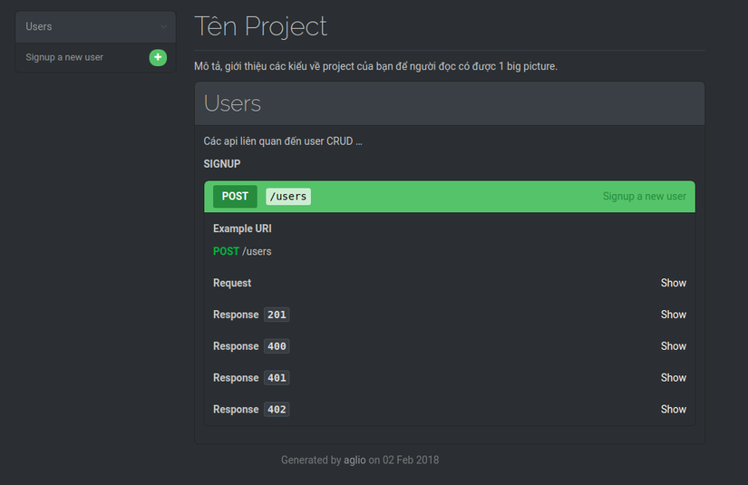

Nhiệm vụ của Backend team khi làm API không chỉ là việc viết code, mà còn là viết documentation cho API đó, sao cho những người sử dụng API (Frontend team, Mobile team, ...) thuận tiện, nhanh chóng và chính xác nhất. 
 
 Trong đó có 3 format để viết API documentation phổ biến và được ưa chuộng là: 
 - SWAGGER 
 - RAML
 - API Blueprint

Mỗi Format có 1 thế mạnh riêng và hãy làm 1 phép so sánh nhỏ để xem Format nào sẽ phù hợp với nhu cầu của bạn

## Comparation

**> SWAGGER**
Ưu điểm: 
- Là Format lâu đời và hoàn thiện nhất, được chống lưng bởi các gã khổng lồ: Google, Mircrosoft, IBM. Chi tiết đến mức có thể dùng để làm API client còn ngon hơn cả postman. Tool đã hoàn thiện và được dùng rộng  khắp: [Editor](https://editor.swagger.io), [Code Gen](https://github.com/swagger-api/swagger-codegen), [Doc Render](https://github.com/swagger-api/swagger-ui). Đặc biệt trong Rails thì tích hợp rất tốt với các lib auto-gen doc ngon: [Rswag](https://github.com/domaindrivendev/rswag), [Grape Swagger](https://github.com/ruby-grape/grape-swagger)

Nhược điểm:
- Cú pháp của nó là JSON, khá phức tạp nếu bạn muốn viết tay. Nó auto-gen doc thì ngon chứ viết tay thì đúng là cực hình, mà nhiều Project thì phải viết API Doc trước khi code để Mobile team có thể chạy song song. Dù sau này swagger đã update viết được bằng YAML nhưng vẫn còn phức tạp

**> RAML** 
Ưu điểm:
- Cái này chưa xài nên chưa thể viết cụ thể được. Tuy nhiên nhìn qua thì thấy Format dựa trên YAML, khá dễ đọc và dễ viết.

Nhược điểm:
- Không OpenSource, cộng đồng bé, khó đặt niềm tin vào vì không hứa hẹn tuơng lai về lâu về dài hay support long-term được vì k open source.

**> API BLUEPRINT**
Ưu điểm:
- Format rất tự nhiên dưới dạng MARKDOWN, cực kỳ đơn giản ngắn gọn, dễ viết. Kể cả với các bạn new dev thì đọc qua 1 lần là viết được luôn. Hỗ trợ 1  danh sách rất dài các [Tools](https://apiblueprint.org/tools.html) ngon: Editors,Testing, Parsers, Mock servers, Renderers, Converters, Lexers. Nên phù hợp với các Project cần viết API trước, mock ngay và luôn phục vụ cho anh em Frontend

Nhược điểm:
- Còn non trẻ và cộng đồng k mạnh như Swagger. Do cú pháp đơn giản nên hậu quả là k đủ thông tin để làm các advance tools như gen code, k thể làm API client như postman.


## Guideline

Trong Guideline này sẽ tập trung vào để guide cách viết API doc dùng API BLUEPRINT vì những ưu điểm của nó phù hợp với các project hiện nay. Mọi người có thể apply cho project của mình ngay mà không mất nhiều learning curve. Đặc biệt nếu bạn đã quen với MARKDOWN thì có lẽ bạn sẽ chỉ mất vài phút để học xong cú pháp.

#### Step 1
Chọn format của blueprint là 1A, tiếp theo là tên của api và 1 chút description
```md
FORMAT: 1A

# Tên Project

Mô tả, giới thiệu các kiểu về project của bạn để người đọc có được 1 big picture.
```
#### Step 2
Viết group. các API liên quan với nhau thường nhóm lại, chẳng hạn như CRUD trên 1 resource user
```md
# Group Users

Các api liên quan đến user CRUD ...
```
#### Step 3
Trong mỗi group, viết các API. Trong dấu ngoặc vuông là path của api đó
```md
## Signup [/users]
```
#### Step 4
Trong mỗi api, viết action, dùng http method gì
```md
### Signup a new user [POST]
```
#### Step 5
Mỗi api nên chứa 1 request và ít nhất 1 response. Có thể chứa thêm headers hoặc attributes nếu cần.  Dùng dấu + để bắt đầu mỗi thứ trên
```md
+ Attributes
    + email: 123@gmail.com (required)
    + password: 123456 (string)
+ Request (application/json)
    + Headers
        Accept-Language: en
+ Response 201
  + Body
    { "session": { "token" : "Bearer 123456798", "refresh_token": "xxx", "expires_at" : "2018-01-31T03:26:56.000Z" } }
+ Response 400
  + Body
    { "error_code": "ERR_0003", "error_message": "Email aready exits" }
+ Response 400
  + Body
    { "error_code": "ERR_0004", "error_message": "Invalid email format" }
```

Vậy là xong, mọi thứ chỉ có thế, bạn có thể dùng chọn editor để live preview và auto check format. Có rất nhiều editor khác nhau tích hợp vào các IDE quen thuộc từ Sublime, Atom, Vim, ... [Pick Editor Here](https://apiblueprint.org/tools.html#editors)

Kết hợp lại, 1 api signup sẽ trông như sau:
```md
FORMAT: 1A

# Tên Project

Mô tả, giới thiệu các kiểu về project của bạn để người đọc có được 1 big picture.

# Group Users
​
Các api liên quan đến user CRUD ...
## Signup [/users]
### Signup a new user [POST]

+ Attributes
    + email: 123@gmail.com (required)
    + password: 123456 (string)
  
+ Request (application/json)

    + Headers
    
            Accept-Language: en
            
+ Response 201
    + Body
    
            { 
                "session": {
                    token" : "Bearer 123456798",
                    "refresh_token": "xxx",
                    "expires_at" : "2018-01-31T03:26:56.000Z" 
                } 
            }
            
+ Response 400
    + Body
    
            { 
                "error_code": "ERR_0003",
                "error_message": "Email aready exits"
            }
            
+ Response 401
    + Body
    
            { 
                "error_code": "ERR_0003",
                "error_message": "Invalid email format"
            }
            
+ Response 402
    + Body
    
            { 
                "error_code": "ERR_0003",
                "error_message": "Invalid password format"
            }
            
```
#### Step 6
Save nội dung phía trên lại tại 1 file docs.md chẳng hạn. Chọn 1 trong những [Render tools](https://apiblueprint.org/tools.html#renderers) ở đây với nhiều theme các nhau tùy bạn chọn. Chúng ta sẽ dùng [Aglio](https://github.com/danielgtaylor/aglio) để thử render API sign up ở trên
```bash
$ npm install -g aglio
$ aglio --theme-variables slate -i docs.md -o output.html 
```
Mở file `output.html` trên để thấy được api đã được render như thế nào



File output.html có thể đẩy lên server staging hoặc share trực tiếp cho Frontend team 

#### Step 7
Ngoài render ra, còn có thể chạy 1 [Mock Server](https://www.npmjs.com/package/drakov) để Frontend có thể mock data mà không cần đợi Backend team implement API.
```bash
$ npm install -g drakov
$ drakov -f docs.md -p 3000
```
Test mock signup API:
```bash
$ curl -v -X POST -H "accept-language: en" -H "content-type: application/json" -d '{"email": "123@gmail.com", "password": "123456"}' http://localhost:3000/users
```
Result:
```bash
Note: Unnecessary use of -X or --request, POST is already inferred.
*   Trying 127.0.0.1...
* Connected to localhost (127.0.0.1) port 3000 (#0)
> POST /users HTTP/1.1
> Host: localhost:3000
> User-Agent: curl/7.47.0
> Accept: */*
> accept-language: en
> content-type: application/json
> Content-Length: 48
> 
* upload completely sent off: 48 out of 48 bytes
< HTTP/1.1 201 Created
< X-Powered-By: Drakov API Server
< Access-Control-Allow-Origin: *
< Access-Control-Allow-Credentials: true
< Access-Control-Allow-Headers: Origin, X-Requested-With, Content-Type, Accept
< Content-Type: application/octet-stream
< Content-Length: 149
< ETag: W/"95-xXeD8AO4yCT5nXiVPgh9FGu8IeE"
< Date: Fri, 02 Feb 2018 10:52:44 GMT
< Connection: keep-alive
< 
{ 
    "session": {
        token" : "Bearer 123456798",
        "refresh_token": "xxx",
        "expires_at" : "2018-01-31T03:26:56.000Z" 
    } 
}
* Connection #0 to host localhost left intact
```
