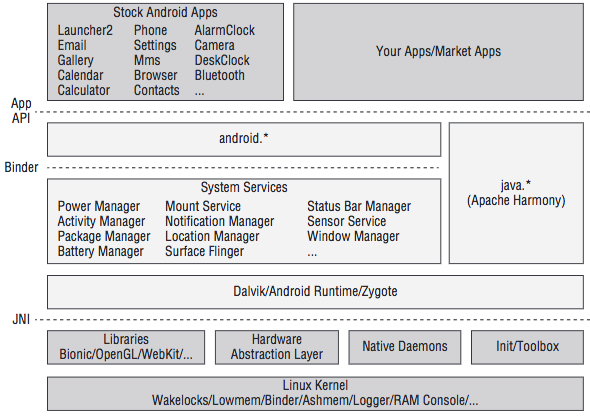
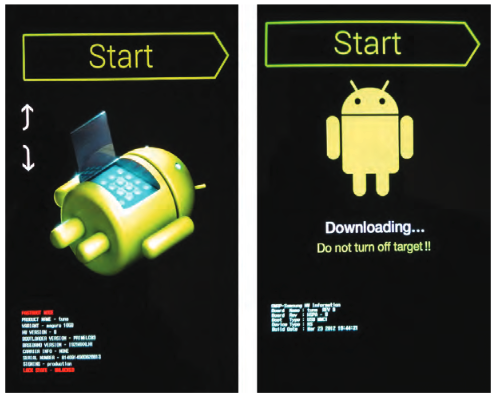
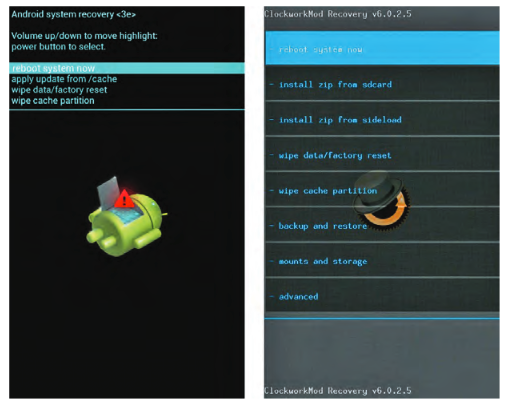

When you are an Android developer, It's totally normal if you don't know how an android phone was built, what is bootloader or how to root an device. We mainly focus on the application layer, where we can use Android Framework to build great apps, publish to google play store and make money. The underlying layer like core library or kernel are stuffs that Google and vendors will take care for us. In my opinions, there is nothing wrong to you guys who spent most of the time on application layer, but there is something really interesting down there:

- the flash memory with millions of transitor that helps us stores gigabyte of data
- the tiny camera but increable powerful, take a photo never been easier that like
- the internet brings the world into your hand
- your album with unlimited numbers of photos you can keep
- your clock, your alarm, your map, ...

I can say the smartphone changes the world, it is one of the most important invention in human history. 
You may feel like nothing special about this, but we have been living in the world without smartphone just 10 years ago, try to remember that time, when a USB 128MB is an amazing thing, a digital camera that helps us see the photo immediatly. Time flies and technology even faster than that. When I was a little boy, I asked myself how they can store freaking data in the small things like USB, how people can talk to each other through a line. Yeah ... 
At that time, I still remember the first smartphone that I have ever seen is O2, people didn't call it smartphone yet, It's a PDA. My uncle hold it, he uses a small pen and write some stuffs on PDA screen. Oh, I got stunned, get attracted to O2, I dreamed about this. I even imagine that my casio watch has ability to call, receive message, ... It's used to be a dream. Now, It's the normal thing. OMG!
Ya, that's why I write this post, just for fun, just satisfy my curiousity. Smartphone and Android are amazing stuff that worth to spend time to dive deeper into it. And you can gain the surprise benefits from it. Android is always open for you to customize, you can build our own operator system, or even build your own phone from scratch like the hack in action movies usually do. That sounds fun, right? You can be a great Android developer regardless of you know the following things or not, but believes me, it's worth the effort. Now, let's take a look at Android System Architecture first, it helps us dive deeper



We are We are so small among the big eco system. Google and venders even do not allow us to access the area of Stock Android Apps. `android.*` can be considered as Android framework, writen by google. `System services` is also made by google but vendor like Samsung or Sony usually modify it to brings us the unique user experience of their brand. `Dalvik/Android Runtime/Zygote` are the boundary between high-order language (java) and low-level things, they are where "Android" run on, provide the virtual machine - the single interface for Android to work on no matter what below hardware are.We are so small among the big eco system. Google and vender even do not allow us to access the area of Stock Android Apps. `android.*` can be considered as Android framework, writen by google. `System services` is also made by google but vendor like Samsung or Sony usually modify it to brings us the unique user experience of their brand. `Dalvik/Android Runtime/Zygote` are the boundary between high-order language (java) and low-level things, they are where "Android" run on, provide the virtual machine - the single interface for Android to work on no matter what below hardware are.
Android is Linux? Ya, It's true, but also false. Android also use Linux kernel but kernel is customized to adapt mobile environment. Android interact with hardware like: memory, cpu, speaker, mic, camera, ... using kernel. You download camera 360 from play store to take some selfies, that application locates in market apps area. You open the app, camera app call `android.*` framework. When you capture a selfie, `android.*` framework tell kernel to control the camera behind your phone, execute some machine code, process the photo and send back to you. That's how Android works. 

Android is powerful and awesome because of its open-source. Anybody are free to read every single lines of code that are public on the internet. But on the other hand, vendors try to do the opposite Android is powerful and awesome because of its open-source. Anybody are free to read every single lines of code that are public on the internet. But on the other hand, vendors try to do the opposite, they stop us from touching anything, keep us live in cage. So, the way to get out of this is `root`, `unlockbootler`, `flash`, ...
By the way,  [XDA-forum](https://forum.xda-developers.com/) is the biggest society about this. You can most of the stuff about hack, root, unlock, ... except the new devices, which have just released and our talent hackers have not touch it yet.

### Some Basic Concepts
They are:
    ■  **boot loader**: Stores the phone’s boot loader program, which takes care of initializing the hardware when the phone boots, booting the Android kernel, and implementing alternative boot modes such as download mode.
    ■ **splash**: Stores the first splash screen image seen right after powering on the device. This usually contains the manufacturer’s or operator’s logo. On some devices, the splash screen bitmap is embedded inside the boot loader itself rather than being stored in a separate partition.
    ■ **boot**: Stores the Android boot image, which consists of a Linux kernel (zImage) and the root file system ram disk (initrd).
    ■ **recovery**: Stores a minimal Android boot image that provides maintenance functions and serves as a failsafe. 
    ■ **system**: Stores the Android system image that is mounted as `/system` on a device. This image contains the Android framework, libraries, system binaries, and pre-installed applications.
    ■ **userdata**: Also called the data partition, this is the device’s internal storage for application data and user files such as pictures, videos, audio, and downloads. This is mounted as `/data` on a booted system.
    ■ **cache**: Used to store various utility files such as recovery logs and update packages downloaded over-the-air. On devices with applications installed on an SD card, it may also contain the `dalvik-cache` folder, which stores the Dalvik Virtual Machine (VM) cache. 
    ■ **radio**: A partition that stores the baseband image. This partition is usually present only on devices with telephony capabilities

### Understanding Boot Process Of Android Phone
1. The boot loader is usually the first thing that runs when the hardware is powered on. On most devices, the boot loader is manufacturer’s proprietary code that takes care of low-level hardware initialization (setup clocks, internal RAM, boot media, and so on) and provides support for loading recovery images or putting the phone into download mode. The boot loader itself is usually comprised of multiple stages, but we only consider it as a whole here.
2. When the boot loader has finished initializing the hardware it loads the Android kernel and `initrd` from the boot partition into RAM. Finally, it jumps into the kernel to let it continue the boot process.
3. The Android kernel does all the tasks needed for the Android system to run properly on the device. For example, it will initialize memory, input/output (I/O) areas, memory protections, interrupt handlers, the CPU scheduler, device drivers, and so on. Finally, it mounts the root file system and starts the first user-space process, init.
4. The init process is the father of all other user-space processes. When it starts, the root file system from the `initrd` is still mounted read/write. The /init.rc script serves as the configuration file for init. It specifies the actions to take while initializing the operating system’s user-space components.  This includes starting some core Android services such as rild for telephony, mtpd for VPN access, and the Android Debug Bridge daemon (adbd). One of the services, Zygote, creates the Dalvik VM and starts the fi rst Java component, System Server. Finally, other Android Framework services, such as the Telephony Manager, are started.
5.  The following shows an excerpt from the init.rc script of an LG Optimus Elite (VM696). You can find more information about the format of this file in the `system/core/init/readme.txt` file from the Android Open Source Project (AOSP) repository.

```
[. . . ]
service adbd /sbin/adbd
        disabled
[. . . ]
service  ril-daemon  /system/bin/rild
        socket rild stream 660 root radio
        socket rild-debug stream 660 radio system
        user root
        group radio cache inet misc audio sdcard_rw qcom_oncrpc diag
[. . . ]
service  zygote  /system/bin/app_process  -Xzygot e /system/bin --zygote --start-system-server
        socket zygote stream 660 root system
        onrestart write /sys/android_power/request_state wake
        onrestart write /sys/power/state on
        onrestart restart media
        onrestart restart netd
[. . . ]
```
6. When the system boot has been completed, an `ACTION_BOOT_COMPLETED` event is broadcasted to all applications that have registered to receive this broad-cast intent in their manifest. When this is complete, the system is considered fully booted.
### Accessing Download Mode
In the boot process description, we mentioned that the boot loader usually pro- vides support for putting the phone into download mode. This mode enables the user to update the persistent storage at a low level through a process typically called  ashing. Depending on the device,  ashing might be available via fastboot protocol, a proprietary protocol, or even both. For example, the Samsung Galaxy Nexus supports both the proprietary ODIN mode and fastboot.
Fastboot is the standard Android protocol for flashing full disk images to specific partitions over USB. The fastboot client utility is a command-line tool that you can obtain from the Android Software Development Kit (SDK) available at [Android SDK](https://developer.android.com/sdk/) or the AOSP repository.
Entering alternate modes, such as download mode, depends on the boot loader. When certain key-press combinations are held during boot, the boot loader starts download mode instead of doing the normal Android kernel boot process. The exact key-press combination varies from device to device, but you can usually easily  nd it online. After it’s in download mode, the device should await a host PC connection through Universal Serial Bus (USB). Following is the fastboot and ODIN mode screens.



When a USB connection has been established between the bootloader and the host computer, communication takes place using the device supported download protocol. These protocols facilitate executing various tasks including  ashing NAND partitions, rebooting the device, downloading and executing an alternate kernel image, and so on.

### Locked and Unlocked Boot Loaders
Generally speaking, locked boot loaders prevent the end user from performing modifications to the device’s firmware by implementing restrictions at the bootloader level. Those restrictions can vary, depending on the manufacturer’s decision, but usually there is a cryptographic signature verify cation that prevents booting and/or  ashing unsigned code to the device. Some devices, such as cheap Chinese Android devices, do not include any boot loader restrictions.
On Google Nexus devices, the boot loader is locked by default. However, there’s an official mechanism in place that enables owners to unlock it. If the end user decides to run a custom kernel, recovery image, or operating system image, the boot loader needs to be unlocked first. For these devices, unlocking the boot loader is as simple as putting the device into fastboot mode and running the command `fastboot oem unlock`. This requires the command-line fastboot client utility, which is available in the Android SDK or the AOSP repository.
Some manufacturers also support unlocking the boot loaders on their devices, on a per-device basis. In some cases the process uses the standard Original Equipment Manufacturer (OEM) unlock procedure through fastboot. However, some cases revolve around some proprietary mechanism such as a website or unlock portal. These portals usually require the owner to register his device, and forfeit his warranty, to be able to unlock its boot loader. As of this writing, HTC, Motorola, and Sony support unlocking at least some of their devices.
Unlocking the boot loader carries serious security implications. If the device is lost or stolen, all data on it can be recovered by an attacker simply by uploading a custom Android boot image or flashing a custom recovery image. After doing so, the attacker has full access to the data contained on the device’s partitions. This includes Google accounts, documents, contacts, stored passwords, application data, camera pictures, and more. Because of this, a factory data reset is performed on the phone when unlocking a locked boot loader. This ensures all the end user’s data are erased and the attacker should not be able to access it.
### Stock and Custom Recovery Images
The Android recovery system is Android’s standard mechanism that allows software updates to replace the entirety of the system software preinstalled on the device without wiping user data. It is mainly used to apply updates down-loaded manually or Over-the-Air (OTA). Such updates are applied of ine after a reboot. In addition to applying OTA updates, the recovery can perform other tasks such as wiping the user data and cache partitions.
The recovery image is stored on the recovery partition, and consists of a mini- mal Linux image with a simple user interface controlled by hardware buttons. The stock Android recovery is intentionally very limited in functionality. It does the minimal things necessary to comply with the Android Compatibility Defination.
Similar to accessing download mode, you access the recovery by pressing a certain key-press combination when booting the device. In addition to using key-presses, it is possible to instruct a booted Android system to reboot into recovery mode through the command a db r e boot r e c ove r y. The command- line Android Debug Bridge (ADB) tool is available as part of the Android SDK o r AOSP repository at [Android website](https://developer.android.com/studio/index.html)
One of the most commonly used features of the recovery is to apply an update package. Such a package consists of a zip file containing a set of  files to be copied to the device, some metadata, and an updater script. This updater script tells the Android recovery which operations to perform on the device to apply the update modifications. This could include mounting the system partition, making sure the device and operating system versions match with the one the update package was created for, verifying SHA1 hashes of the system files that are going to be replaced, and so on. Updates are cryptographically signed using an RSA private key. The recovery verifies the signature using the corresponding public key prior to applying the update. This ensures only authenticated updates can be applied. The following snippet shows the contents of a typical Over-the-Air (OTA) update package.
Custom Android recovery images exist for most devices. If one is not available, you can easily create it by applying custom modi cations to the stock Android recovery source code from the AOSP repository.
The most common modi cations included in custom recovery images are:

■ Including a full backup and restore functionality (such as NANDroid script)
■ Allow unsigned update packages, or allow signed packages with custom keys
■ Selectively mounting device partitions or SD card
■ Provide USB mass storage access to SD card or data partitions
■ Provide full ADB access, with the ADB daemon running as root
■ Include a fully featured BusyBox binary

Popular custom recovery images with builds for multiple devices are ClockworkMod recovery or TeamWin Recovery Project (TWRP)

### Rooting with an Unlocked Boot Loader
The process of rooting culminates in having an `su` binary with the proper set-uid permissions on the system partition. This allows elevating privileges whenever needed. The `su` binary is usually accompanied by an Android application, such as SuperUser or SuperSU, that provides a graphical prompt each time an application requests root access. If the request is granted, the application invokes the `su` binary to execute the requested command. These `su` wrapper Android applications also manage which applications or users should be granted root
access automatically, without prompting the user.
On devices with an unlocked or unlockable boot loader, gaining root access is very easy, as you do not have to rely on exploiting an unpatched security hole. The  rst step is to unlock the boot loader. If you haven’t done it already, depending on the device you should either use `fast boot oem unlock` as described in the “Locked and Unlocked Boot Loaders” section, or use a vendor-specific boot loader unlock tool to legitimately unlock the device.
At the time of this writing, Motorola, HTC, and Sony-Ericsson support boot loader unlocking on some devices through their unlock portal websites.
When the boot loader is unlocked, the user is free to make custom modfications to the device. At this point, there are several ways to include the appropriate `su` binary for the device’s architecture in the system partition, with the correct permissions.
You can modify a factory image to add an `su` binary. In this example, we unpack an ext4 formatted system image, mount it, add an `su` binary, and repack it. If we  ash this image, it will contain the `su` binary and the device will be rooted.
```bash
mkdir systemdir
simg2img  system.img  system.raw
mount  - t  ext4  -o  loop  system.raw  systemdir
cp su systemdir/xbin/su
chown 0:0 systemdir/xbin/su
chmod 6755 systemdir/xbin/su
make_ext4fs  -s  -l  512M  -a  system   custom-system.img  systemdir
unmount systemdir
```
### Rooting with a Locked Boot Loader
When the boot loader is locked, and the manufacturer doesn’t provide a legiti- mate method to unlock it, you usually need to find a law in the device that will serve as an entry point for rooting it.
First you need to identify which type of bootloader lock you have; it can vary depending on the manufacturer, carrier, device variant, or software version within the same device. Sometimes, fastboot access is forbidden but you can still  ash using the manufacturer’s proprietary flashing protocol, such as Motorola SBF or Samsung ODIN. Sometimes signature checks on the same device are enforced differently when using fastboot instead of the manufacturer’s proprietary download mode. Signature checking can happen at boot time, at flashing time, or both.
Some locked boot loaders only enforce signature veri cation on selected partitions; a typical example is having locked boot and recovery partitions. In this case booting a custom kernel or a modified recovery image is not allowed, but you can still modify the system partition. In this scenario, you can perform rooting by editing the system partition of a stock image as described in the “Rooting with an Unlocked Boot Loader” section.
On some devices, where the boot partition is locked and booting a custom kernel is forbidden, it is possible to  ash a custom boot image in the recovery partition and boot the system with the custom kernel by booting in recovery mode when powering on the phone. In this case, it is possible to get root access through `adb shell` by modifying the `default.prop` of the custom boot image initrd, as you’ll see in the “Abusing adbd to Get Root” section. On some devices, the stock recovery image allows applying updates signed with the default Android test key. This key is a generic key for packages that do not otherwise specify a key. It is included in the `build/target/product/security` directory in the AOSP source tree. You can root by applying a custom update package containing the `su` binary. It is unknown whether the manufacturer has left this on purpose or not, but this is known to work on some Samsung devices with Android 4.0 and stock recovery 3e.
In the worst-case scenario, boot loader restrictions won’t allow you to boot with a partition that fails signature veri cation. In this case, you have to use other techniques to achieve root access, as described in the “Gaining Root on a Booted System” section.
### Gaining Root on a Booted System
Gaining initial root access on a booted system consists of getting a root shell through an unpatched security  aw in the Android operating system. A rooting method like this is also widely known as a soft root because the attack is almost entirely software based. Usually, a soft root is accomplished through a vulnerability in the Android kernel, a process running as root, a vulnerable program with the set-uid bit set, a symbolic link attack against a permission bug, or other issues. There are a vast number of possibilities due to the sheer number of areas in which issues could be introduced and types of mistakes programmers could make.
Although root set-uid or set-gid binaries are not common in stock Android, carriers or device manufacturers sometimes introduce them as part of their custom modi cations. A typical security  aw in any of these set-uid binaries can lead to privilege escalation and subsequently yield root access.
Another typical scenario is exploiting a security vulnerability in a process running with root privileges. Such an exploit enables you to execute arbitrary code as root. The end of this chapter includes some examples of this.
These exploits are becoming more difficult to develop as Android matures. New mitigation techniques and security hardening features are regularly introduced with new Android releases.
### That's all! Get your hand dirty
If you are owning an Android phone. What are you waiting for! DO IT

